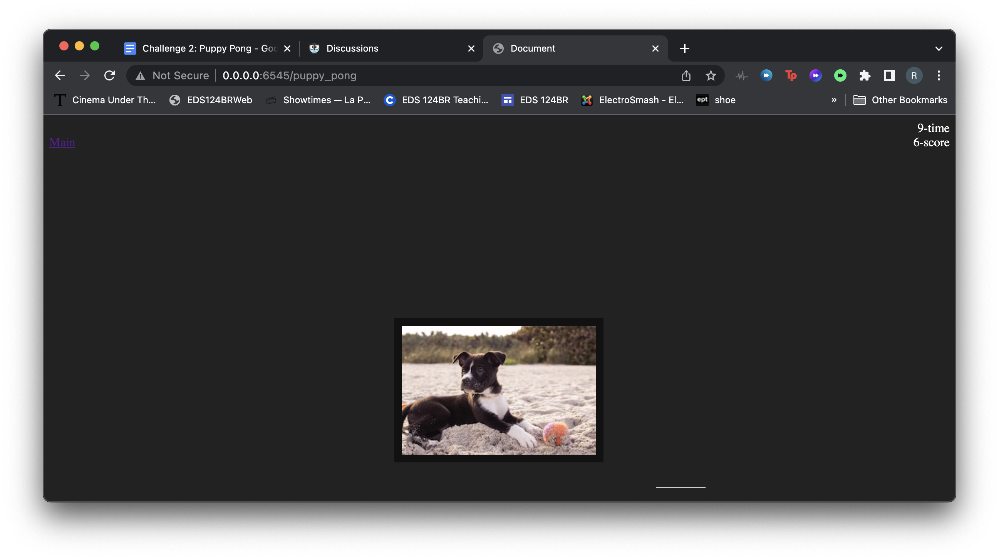
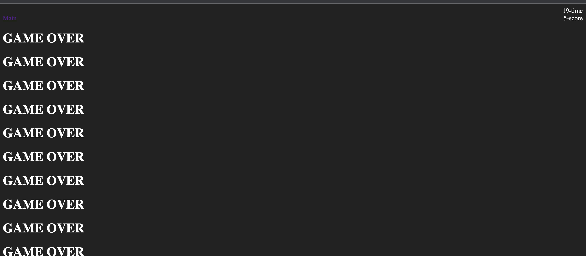

## Raul Valadez A16167148

# Tech Assignment 3

## Tutorials

In your README.md

### Tutorial 2

I became comfortable with javascript in this tutorial. The myFunction function makes a pop up appear.

https://codepen.io/raulsoad427/pen/KKBrOWV?editors=1010

### Tutorial 3

This tutorial was the introduction to being able to access html elements. We then manipulated them and edited them. You can even add an html element after the fact.
https://codepen.io/raulsoad427/pen/PoBxRKa

## Challenges

### Challenge 1: Time Zones

For this challenge I became more comfortable manipulating data using JavaScript.


I had to also use the Date object in order to get the current time.
I also created a button that was a Div and it added a time to the page.
In order to update the time I had an interval go through each one of the times and every 60000 miliseconds I added one to the minute until it turned into it turned >59 then it goes to one more hour.


```js
addDivButton.addEventListener("click", (event) => {
  addTime(textInput.value + " " + currentTimeOfZone(textInput.value));
  console.log(currentTimeOfZone);
});
```

### Challenge 2: Puppy Pong

I had it that when it touches the Bar it bounces back by implementing a bounce() function which I ran in intervals of 25 milliseconds

```js
function bounce() {
  if (
    theImg.style.left < theBar.style.left &&
    theY > theBody.offsetHeight * 0.55
  ) {
    theScore.innerHTML = currScore += 1;
    theDeltaY *= -1;
  }
}
```

In order to have the movement of the bar go with motion of the mouse. I had to look up how to attach mouse movement to the bar. I attached it to the left part of the bar.



Then once I implemented the bar movement the puppy would bounce off off the bar. Since the image was bigger I had the imgL \< barL and imgR \> barR when it did not I made it go invisible and spit out GAME OVERs



Thank you,
Raul Valadez
